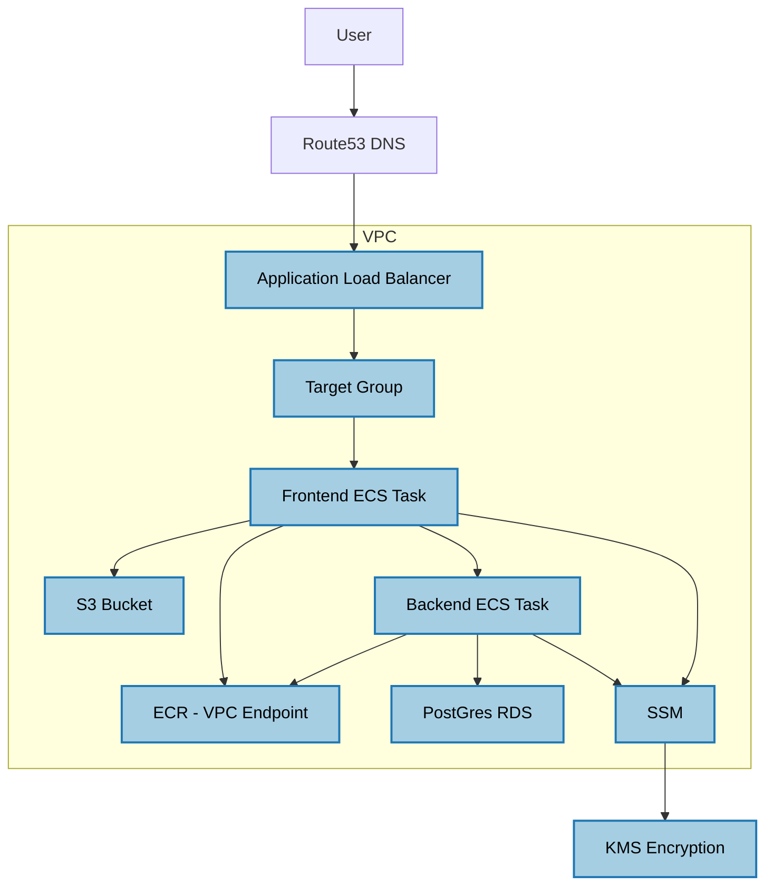

# shopease
demo project for a technical interview 

## Architecture Diagram

## Main.tf Resource - Fargate ECS

I chose for the terraform snippet Fargate-ECS with the datadog implementation, as container orchestration is the heart of both the pipeline and the scalability of our app, as is the observability of our application once it is in the cloud. The suggested terraform snippet was developed based on the [Datadog Documentation for ECS-FARGATE log forwarding](https://docs.datadoghq.com/integrations/ecs_fargate/?tab=cloudformation#log-collection). For more information on why I chose Datadog, and specifically utilizing Fluent Bit and FireLens for ECS Fargate, [please see the docs/datadog-reasoning.md](docs/datadog-reasoning.md)

I chose to approach the architecture diagram from a user perspective, which would be to log into the frontend that was made available via Route53 DNS to our ALB, a target group, then to our frontend ECS tasks, which communicate with backend ECS tasks (the Java API). The frontend grabs assets from the s3 bucket.  The backend manages product inventory via PostGres in RDS.  Both the frontend and backend grab their images from ECR via vpc endpoints. All the infrastructure is within a VPC.  Both the frontend and Backend need secret management, which will be done via SSM and KMS encryption. 

Security groups and IAM were needed to be configured for all the above resources to communicate securely.   

## Further Reading

For more detailed information on the topics discussed, refer to the following documents in the `docs` directory:

- [Development to Production](docs/development-to-production.md) (pipeline and differences between environments)
- [Datadog Reasoning](docs/datadog-reasoning.md) (cost and scalability)
- [AWS Resources Involved](docs/aws-resources-involved.md) (scalability and security)
- [ECS vs EKS](docs/ecs-vs-eks.md) (cost and scalability )
